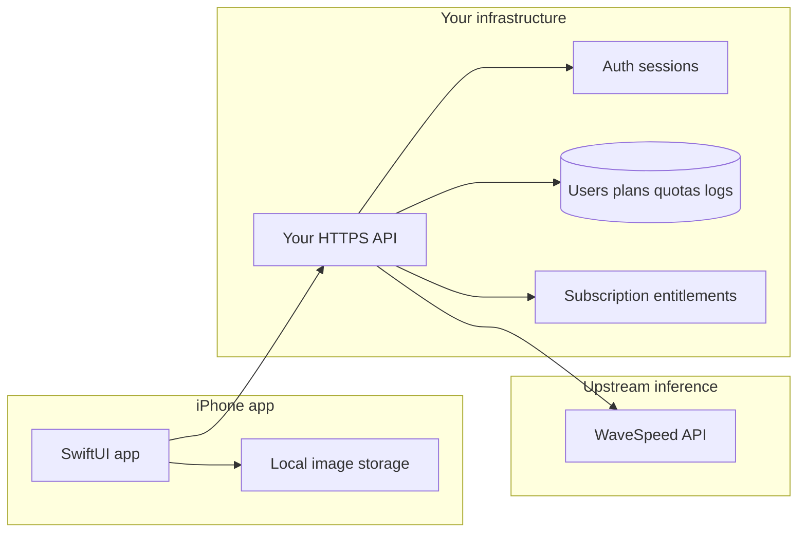

# Standalone iOS app — product & architecture (for contributors & AI assistants)

This document captures **decisions and constraints** for a **new, App Store–distributed iOS app** that is **not branded** as the WaveSpeed desktop product. It exists so **humans and other AI tools** can align on the same plan without re-deriving context from chat.

**Last updated:** 2026-03-26

---

## Audience

- Engineers implementing the iOS client, backend, or billing.
- AI assistants asked to suggest code, infra, or review changes.

---

## Confirmed product decisions

### A) Monetization: **subscription**

- Users pay via a **subscription** (not the only possible add-on later, but **subscription is the chosen model**).
- On **iOS**, digital subscriptions for in-app features are typically implemented with **Apple In-App Purchase (IAP)** (e.g. auto-renewable subscriptions), subject to App Store Review Guidelines and your legal counsel’s advice.

### B) Generation path: **only through your backend** (you are **not** misunderstanding)

| Layer | Responsibility |
|--------|----------------|
| **iOS app** | Authenticates to **your** backend, requests generations **only** from **your** API, stores images **on device** (or user-approved photo library flows), shows subscription state. |
| **Your backend** | **Owns** user accounts, **subscription / entitlement** state, **usage metering**, **rate limits**, **audit logs**, and **all calls** to WaveSpeed (or other inference providers). Holds **server-side** API credentials. |
| **WaveSpeed HTTP API** | Called **only** by **your backend**, not by the retail app with a per-user WaveSpeed API key embedded in the client. |

**Correct mental model:** the phone is a **client of your product**. Your product is a **gateway** that enforces business rules and then calls upstream inference.

**Anti-pattern for this project:** shipping the WaveSpeed API key inside the iOS binary or having each end user paste a WaveSpeed key into the app for production traffic. That breaks centralized metering, billing alignment, and key secrecy.

---

## High-level architecture

---

## Why backend-only generation

1. **Secrets:** WaveSpeed credentials stay on servers you control (rotation, abuse response).
2. **Business rules:** Subscriptions, credits, fair-use, and per-plan limits are enforced **before** spend.
3. **Observability:** Per-user job history, cost attribution, and support/debugging.
4. **App Store fit:** The app sells **your** service; upstream is an implementation detail.

---

## What the iOS app should implement (baseline)

- **Registration / sign-in** to **your** backend (exact method TBD: Sign in with Apple, email, etc.).
- **Subscription management** via **IAP**, with **receipt validation** (or StoreKit 2 / App Store Server API) on **your backend** to unlock entitlements.
- **Generation requests** as **your** API calls (e.g. `POST /v1/jobs`); backend returns job id, status URLs, or pushes updates.
- **Local media:** Save outputs under the app sandbox and/or export to Photos per user permission; **no requirement** to upload user images to your servers unless a feature explicitly needs it (document that in privacy policy if you do).

---

## What your backend should implement (baseline)

- **User identity** and **sessions** (e.g. JWT access + refresh, or session cookies for web—mobile usually token-based).
- **Entitlements:** “active subscription,” tier, renewal state—**source of truth** after validating Apple transactions.
- **Metering:** Per request/job: user id, timestamp, model id, status, optional cost estimate, idempotency keys where needed.
- **Enforcement:** Reject or queue jobs when over quota or unpaid.
- **Upstream integration:** Single integration module that calls WaveSpeed (`https://api.wavespeed.ai` or as documented) using **environment-stored** keys.

---

## Compliance & legal (non-exhaustive reminders)

- **Apple:** App Review, IAP rules, privacy nutrition labels, account deletion expectations where applicable.
- **Privacy:** Clear policy for data you collect (account email, usage logs, crash analytics).
- **WaveSpeed / upstream:** Using their HTTP API for a **consumer app** may be subject to their **terms of service** and acceptable use; **rebranding the UI does not replace** contractual permission for how you operate the service. Keep keys server-side; obtain appropriate commercial/legal clearance for your distribution model.

---

## Relationship to this repository

- The **Electron desktop app** in this repo is a **separate product surface** (local tools, workflow, etc.).
- The **Swift package** under `ios/InferenceAPI/` was scaffolded as a **direct HTTP client** for early experiments. For the **App Store app** described here, the **production iOS client should call your backend**, not WaveSpeed directly—unless you intentionally maintain a **dev-only** direct path (guarded by build flags) for internal testing.

When adding code, prefer naming and modules that reflect **your app’s** API contract, not the upstream vendor’s brand.

---

## Open items (intentionally TBD)

Record decisions here as they land:

- [ ] Backend stack (language, framework, host).
- [ ] Database (Postgres, etc.) and migration strategy.
- [ ] Exact auth methods (Sign in with Apple only vs email).
- [ ] IAP product IDs, subscription groups, and grace period handling.
- [ ] Job API shape (sync vs async, webhooks, polling).
- [ ] Rate limits per tier and definition of a “generation unit.”

---

## Glossary

| Term | Meaning in this doc |
|------|---------------------|
| **Your backend** | The service **you** operate for accounts, billing state, metering, and upstream calls. |
| **Upstream** | WaveSpeed HTTP API (or additional providers later). |
| **Entitlement** | Whether the user may run a paid action (e.g. active subscription). |
